<div align="center">


<h2>♻️ Sustainable E-Waste Management Platform</h2>
<h3>🚀 Built in 24 Hours | 🏆 MIT Mysore Hackathon Winner | 🌍 Join the Green Revolution!</h3>

<br>

<p align="center">
  <a href="https://e-waste-ex.netlify.app" target="_blank">
    
  </a>
  
  
  
</p>

<br>

<table align="center">
<tr>
<td align="center" width="25%">
<b>♻️ Eco-Friendly</b>
<br><sub>Sustainable recycling</sub>
</td>
<td align="center" width="25%">
<b>🤖 AI-Powered</b>
<br><sub>Smart assistance</sub>
</td>
<td align="center" width="25%">
<b>🔒 Secure</b>
<br><sub>Safe transactions</sub>
</td>
<td align="center" width="25%">
<b>⚡ Fast</b>
<br><sub>Quick pickups</sub>
</td>
</tr>
</table>


</div>

---

## 🌟 Overview

<div align="center">


</div>

**E-Waste Exchange Platform** is a revolutionary web application designed to facilitate the responsible disposal, exchange, and management of electronic waste. Built during a 24-hour hackathon at MIT Mysore, this platform bridges the gap between e-waste generators and recyclers, creating a sustainable circular economy.

<br>

<div align="center">

<table>
<tr>
<td align="center" width="33%">
<h3>🎯 10+ Features</h3>
<p>Comprehensive e-waste management tools</p>
</td>
<td align="center" width="33%">
<h3>💻 Modern Stack</h3>
<p>Built with latest technologies</p>
</td>
<td align="center" width="33%">
<h3>🏆 Award Winner</h3>
<p>MIT Mysore Hackathon Champion</p>
</td>
</tr>
</table>


</div>

---

## ✨ Key Features

<div align="center">


</div>

<table>
<tr>
<td width="50%" valign="top">

<div align="center">

</div>

### 🤖 AI-Powered Assistant
- 🎯 **ElectroAI** chatbot for instant support
- 🔍 Smart e-waste identification
- 💰 Pricing recommendations
- 📋 Disposal guidelines
- ⚡ Real-time responses

</td>
<td width="50%" valign="top">

<div align="center">

</div>

### 🛒 Marketplace
- 🛍️ Buy and sell e-waste components
- 📊 Real-time pricing updates
- 🔐 Secure transactions
- ⭐ Rating & review system
- 🎨 User-friendly interface

</td>
</tr>
<tr>
<td width="50%" valign="top">

<div align="center">

</div>

### 📦 Smart Pickup System
- 🚚 Schedule doorstep pickups
- 📍 Track pickup status
- ⏰ Multiple time slots
- 🔔 Real-time notifications
- 📱 Mobile-friendly booking

</td>
<td width="50%" valign="top">

<div align="center">

</div>

### 💳 Transaction Management
- 📜 Complete transaction history
- 🧾 Digital receipts
- 💵 Earnings tracker
- 💳 Payment gateway integration
- 📊 Analytics dashboard

</td>
</tr>
</table>

<br>

<div align="center">


### 🎮 Interactive Demo

<a href="https://e-waste-ex.netlify.app" target="_blank">

</a>


</div>

---

## 🎨 Platform Showcase

<div align="center">

<br>

### 🔐 Authentication Portal
<kbd>

</kbd>

<br><br>


<details>
<summary></summary>

<br>

### 🏠 Dashboard Overview
<kbd>

</kbd>

<br><br>


### 📖 Platform Guide
<kbd>

</kbd>

<br><br>


### 🤖 ElectroAI Assistant
<kbd>

</kbd>

<br><br>


### ⚡ Quick Actions Panel
<kbd>

</kbd>

<br><br>


### 🛍️ E-Waste Marketplace
<kbd>

</kbd>

<br><br>


### 🛒 Shopping Cart
<kbd>

</kbd>

<br><br>


### 📊 Transaction History
<kbd>

</kbd>

<br><br>


### 📅 Schedule Pickup
<kbd>

</kbd>

<br><br>


### 📞 Support Helpline
<kbd>

</kbd>

<br><br>

</details>

<br>

<a href="https://e-waste-ex.netlify.app" target="_blank">

</a>

</div>

---

## 🚀 Getting Started

### Prerequisites

```bash
node >= 14.x
npm >= 6.x
```

### 📥 Installation

```bash
# Clone the repository
git clone https://github.com/HYVIKAS6/E-waste-exchange-platform-.git

# Navigate to project directory
cd E-waste-exchange-platform-

# Install dependencies
npm install

# Start the development server
npm start
```

### 🌐 Environment Variables

Create a `.env` file in the root directory:

```env
REACT_APP_API_URL=your_api_url
REACT_APP_AI_API_KEY=your_ai_key
REACT_APP_PAYMENT_KEY=your_payment_key
```

<div align="center">


</div>

---

## 🛠️ Tech Stack

<div align="center">


<br>

### 🎨 Frontend Technologies

<table>
<tr>
<td align="center" width="100">

<br>React
</td>
<td align="center" width="100">

<br>JavaScript
</td>
<td align="center" width="100">

<br>Tailwind
</td>
<td align="center" width="100">

<br>HTML5
</td>
<td align="center" width="100">

<br>CSS3
</td>
</tr>
</table>

### ⚙️ Backend & Database

<table>
<tr>
<td align="center" width="100">

<br>Express
</td>
<td align="center" width="100">

<br>Firebase
</td>
<td align="center" width="100">

<br>NPM
</td>
</tr>
</table>

### 🤖 AI & Deployment

<table>
<tr>
<td align="center" width="100">

<br>AI/ML
</td>
<td align="center" width="100">

<br>GitHub
</td>
<td align="center" width="100">

<br>Netlify
</td>
<td align="center" width="100">

<br>VS Code
</td>
</tr>
</table>


</div>

---

## 🎯 Core Modules

```mermaid
graph TD
    A[🌐 E-Waste Platform] --> B[👤 User Authentication]
    A --> C[🛒 Marketplace]
    A --> D[🤖 AI Assistant]
    A --> E[📦 Pickup System]
    A --> F[💳 Transaction Manager]
    
    B --> B1[🔐 Login/Register]
    B --> B2[👨‍💼 Profile Management]
    
    C --> C1[🔍 Browse Items]
    C --> C2[📝 List E-Waste]
    C --> C3[🛍️ Shopping Cart]
    
    D --> D1[💬 ElectroAI Chat]
    D --> D2[💰 Price Estimation]
    
    E --> E1[📅 Schedule Pickup]
    E --> E2[📍 Track Status]
    
    F --> F1[💳 Payment Gateway]
    F --> F2[📜 History]
    
    style A fill:#00D9FF,stroke:#0099CC,stroke-width:3px,color:#000
    style B fill:#00F700,stroke:#00CC00,stroke-width:3px,color:#000
    style C fill:#FF6B35,stroke:#CC5529,stroke-width:3px,color:#fff
    style D fill:#FFD700,stroke:#CCB000,stroke-width:3px,color:#000
    style E fill:#9B59B6,stroke:#7D3C98,stroke-width:3px,color:#fff
    style F fill:#E74C3C,stroke:#C0392B,stroke-width:3px,color:#fff
```

<div align="center">


<br><br>



</div>

---

## 📱 Platform Workflow

<div align="center">


### 🔄 User Journey

<table>
<tr>
<td align="center" width="20%">

<br><b>Step 1</b><br>
<sub>🔐 Sign Up/Login</sub><br>
<sup>Create your account</sup>
</td>
<td align="center" width="5%">

</td>
<td align="center" width="20%">

<br><b>Step 2</b><br>
<sub>🛒 Browse/List</sub><br>
<sup>Buy or sell e-waste</sup>
</td>
<td align="center" width="5%">

</td>
<td align="center" width="20%">

<br><b>Step 3</b><br>
<sub>💳 Payment</sub><br>
<sup>Secure transaction</sup>
</td>
</tr>
<tr>
<td colspan="5" align="center">

</td>
</tr>
<tr>
<td align="center" width="20%">

<br><b>Step 6</b><br>
<sub>⭐ Review</sub><br>
<sup>Rate your experience</sup>
</td>
<td align="center" width="5%">

</td>
<td align="center" width="20%">

<br><b>Step 5</b><br>
<sub>✅ Pickup Done</sub><br>
<sup>E-waste collected</sup>
</td>
<td align="center" width="5%">

</td>
<td align="center" width="20%">

<br><b>Step 4</b><br>
<sub>📅 Schedule</sub><br>
<sup>Book pickup slot</sup>
</td>
</tr>
</table>

<br>

### 🎯 Complete Cycle

```mermaid
graph LR
    A[🔐 Register] -->|Create Account| B[🏠 Dashboard]
    B -->|Browse| C[🛍️ Marketplace]
    B -->|List Item| C
    C -->|Add to Cart| D[🛒 Cart]
    D -->|Checkout| E[💳 Payment]
    E -->|Success| F[📅 Schedule Pickup]
    F -->|Confirm| G[📦 Processing]
    G -->|Collect| H[✅ Completed]
    H -->|Feedback| I[⭐ Review]
    I -->|Return| B
    
    style A fill:#00D9FF,stroke:#0099CC,stroke-width:3px,color:#000
    style B fill:#00F700,stroke:#00CC00,stroke-width:3px,color:#000
    style C fill:#FF6B35,stroke:#CC5529,stroke-width:3px,color:#fff
    style E fill:#FFD700,stroke:#CCB000,stroke-width:3px,color:#000
    style H fill:#00F700,stroke:#00CC00,stroke-width:3px,color:#000
    style I fill:#FF69B4,stroke:#CC5290,stroke-width:3px,color:#000
```




</div>

---

## 🌈 Features Breakdown

<div align="center">


</div>

<table>
<tr>
<td width="50%" valign="top">

<div align="center">

<h3>🎪 User Features</h3>
</div>

```diff
+ Secure authentication system
+ Personalized dashboard
+ Real-time notifications
+ Transaction tracking
+ E-waste listing management
+ Profile customization
+ Wishlist functionality
+ Order history
```

</td>
<td width="50%" valign="top">

<div align="center">

<h3>🤖 AI Features</h3>
</div>

```diff
+ Intelligent chatbot (ElectroAI)
+ Automated price suggestions
+ E-waste categorization
+ Disposal recommendations
+ Smart search & filtering
+ Predictive analytics
+ Image recognition
+ Voice assistance
```

</td>
</tr>
<tr>
<td width="50%" valign="top">

<div align="center">

<h3>🛡️ Admin Features</h3>
</div>

```diff
+ User management
+ Platform analytics
+ Pickup coordination
+ Quality control
+ Revenue tracking
+ Content moderation
+ System monitoring
+ Report generation
```

</td>
<td width="50%" valign="top">

<div align="center">

<h3>🔐 Security Features</h3>
</div>

```diff
+ End-to-end encryption
+ Secure payment gateway
+ Data privacy protection
+ Two-factor authentication
+ Regular security audits
+ GDPR compliance
+ Fraud detection
+ Backup & recovery
```

</td>
</tr>
</table>

<br>

<div align="center">

</div>

---

## 👨‍💻 Developer

<div align="center">


<br><br>

<a href="https://vikashy.netlify.app">
  
</a>

<br><br>

<table>
<tr>
<td align="center">
<a href="https://github.com/HYVIKAS6">
<br />
<sub><b><h2>Vikas H Y</h2></b></sub>
</a>
<br>
<p>
<a href="https://vikashy.netlify.app">

</a>
<a href="https://github.com/HYVIKAS6">

</a>
<a href="https://linkedin.com/in/vikashy">

</a>
</p>
<br>

<p><i>Full Stack Developer | Hackathon Winner | Open Source Enthusiast</i></p>
</td>
</tr>
</table>

<br>

### 🎓 Built at MIT Mysore Hackathon 2024


<p><b>⏱️ Development Time:</b> 24 Hours</p>
<p><b>🏆 Achievement:</b> Hackathon Winner</p>
<p><b>🎯 Theme:</b> Sustainable Technology</p>

<br>


</div>

---

## 🤝 Contributing

<div align="center">


<br>

### We Love Contributions! 💚


</div>

Contributions are always welcome! Here's how you can help make this project even better:

<table>
<tr>
<td align="center" width="25%">

<br><b>1. Fork</b>
<br><sub>Fork the repo</sub>
</td>
<td align="center" width="25%">

<br><b>2. Branch</b>
<br><sub>Create feature branch</sub>
</td>
<td align="center" width="25%">

<br><b>3. Commit</b>
<br><sub>Commit changes</sub>
</td>
<td align="center" width="25%">

<br><b>4. PR</b>
<br><sub>Open pull request</sub>
</td>
</tr>
</table>

### 📝 Steps to Contribute

```bash
# 1. Fork the repository
# 2. Clone your fork
git clone https://github.com/your-username/E-waste-exchange-platform-.git

# 3. Create a new branch
git checkout -b feature/AmazingFeature

# 4. Make your changes and commit
git commit -m '✨ Add some AmazingFeature'

# 5. Push to your branch
git push origin feature/AmazingFeature

# 6. Open a Pull Request
```

<div align="center">

### 🌟 Top Contributors

<a href="https://github.com/HYVIKAS6/E-waste-exchange-platform-/graphs/contributors">
  
</a>

<br><br>


</div>

---

## 📄 License

<div align="center">


<br>

This project is licensed under the **MIT License**


See the [LICENSE](LICENSE) file for details

<br>


</div>

---

## 🌟 Acknowledgments

<div align="center">


<br>

<table>
<tr>
<td align="center" width="33%">

<br><b>MIT Mysore</b>
<br><sub>For hosting the hackathon</sub>
</td>
<td align="center" width="33%">

<br><b>Contributors</b>
<br><sub>All supporters</sub>
</td>
<td align="center" width="33%">

<br><b>Open Source</b>
<br><sub>The community</sub>
</td>
</tr>
</table>

<br>

### 💝 Special Thanks To

 Hackathon organizers and mentors  
 Beta testers and early adopters  
 Environmental activists who inspired this project  
 Open-source libraries and tools used


</div>

---

## 📞 Contact & Support

<div align="center">


<br><br>

### 💬 Get In Touch

<p>Have questions? Need support? Want to collaborate?</p>

<br>

<a href="https://github.com/HYVIKAS6">

</a>
<a href="https://vikashy.netlify.app">

</a>
<a href="https://e-waste-ex.netlify.app">

</a>

<br><br>

### 📧 Connect With Me

<a href="https://github.com/HYVIKAS6">
  
</a>
<a href="https://linkedin.com/in/vikashy">
  
</a>
<a href="https://vikashy.netlify.app">
  
</a>
<a href="mailto:vikas@example.com">
  
</a>

<br>


</div>

---

## 📊 Project Statistics

<div align="center">


<br><br>

### 🎯 GitHub Stats


<br><br>

### 🚀 Project Milestones


<br><br>

### 📈 Activity Graph


<br>


</div>

---

## 🎬 Demo Video

<div align="center">


<br><br>

### 📹 Watch Platform in Action

<a href="https://e-waste-ex.netlify.app">

</a>

<br><br>

<p><i>Experience the full functionality of our E-Waste Exchange Platform</i></p>


</div>

---

## 💡 Future Roadmap

<div align="center">


</div>

<table>
<tr>
<td width="50%">

### 🔮 Upcoming Features

- [ ] 📱 Mobile Application (iOS & Android)
- [ ] 🌍 Multi-language Support
- [ ] 🔔 Push Notifications
- [ ] 📊 Advanced Analytics Dashboard
- [ ] 🤝 Partnership with NGOs
- [ ] 🎮 Gamification & Rewards
- [ ] 🗺️ Interactive Map Integration
- [ ] 💬 Community Forum

</td>
<td width="50%">

### 🎯 Long-term Goals

- [ ] 🌐 Global Expansion
- [ ] 🏭 Industrial E-waste Management
- [ ] 📜 Government Certifications
- [ ] 🔬 Research Integration
- [ ] 🎓 Educational Programs
- [ ] 🌱 Carbon Credit System
- [ ] 🤖 Advanced AI Features
- [ ] 📊 Blockchain Integration

</td>
</tr>
</table>

<div align="center">

<br>


</div>

---

<div align="center">


<br>

### 💚 Made with Love for a Sustainable Future 🌍


<br>

### 🎉 Thank You for Visiting!


<br>

<p>
<sub>Built with ❤️ by <a href="https://github.com/HYVIKAS6">Vikas H Y</a> during MIT Mysore Hackathon 2024</sub>
</p>

<br>

<a href="#top">

</a>

<br><br>

### 🌟 Show Your Support

<p>Give a ⭐️ if this project helped you or you find it interesting!</p>

<br>

</div>
